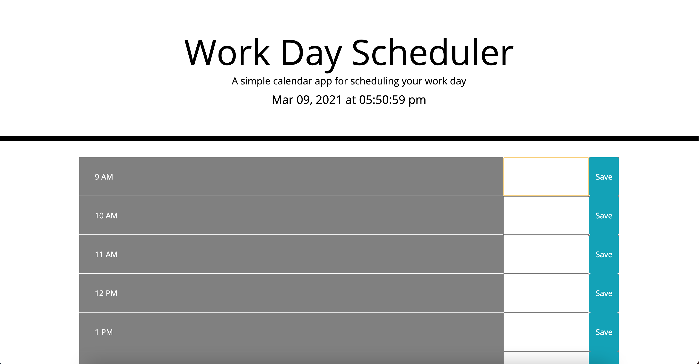

# Work-Day-Scheduler

This is a simple calendar application that allows a user to save events for each hour of the day by modifying starter code. This app will run in the browser and feature dynamically updated HTML and CSS powered by jQuery.

## Installation
To access codebase,

* Go to https://github.com/lizaferguson/Work-Day-Scheduler
* Click Code
* Select Download Zip or Clone onto local device by copying the link https://lizaferguson.github.io/Work-Day-Scheduler/ into gitbash/terminal on your machine
* Open files in preferred text editor or web browser

## Usage
This web application is a simple hourly calendar to log events and store locally. The application appears as such:

## Credits
The orginal codebase can be found at https://unc.bootcampcontent.com/UNC-Coding-Boot-Camp/unc-ral-virt-fsf-pt-01-2021-u-c/tree/master

## License
© 2021 Trilogy Education Services, LLC, a 2U, Inc. brand. Confidential and Proprietary. All Rights Reserved.